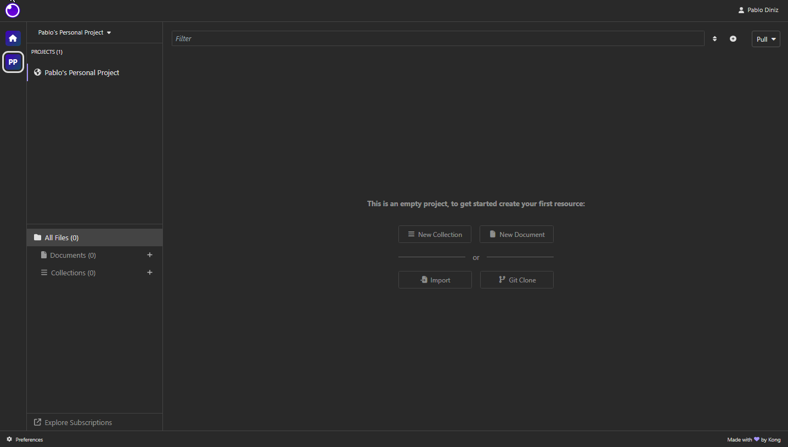
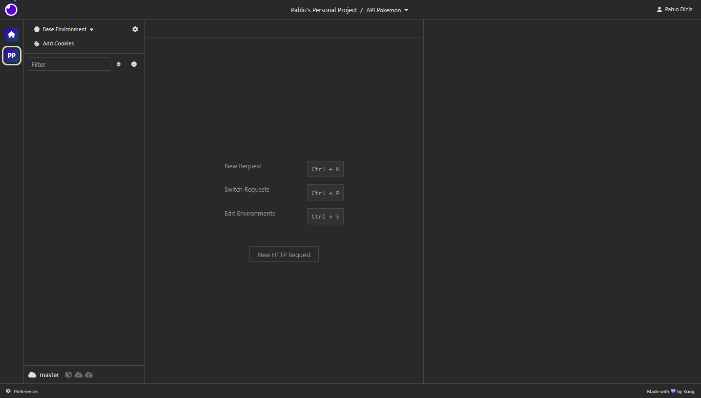
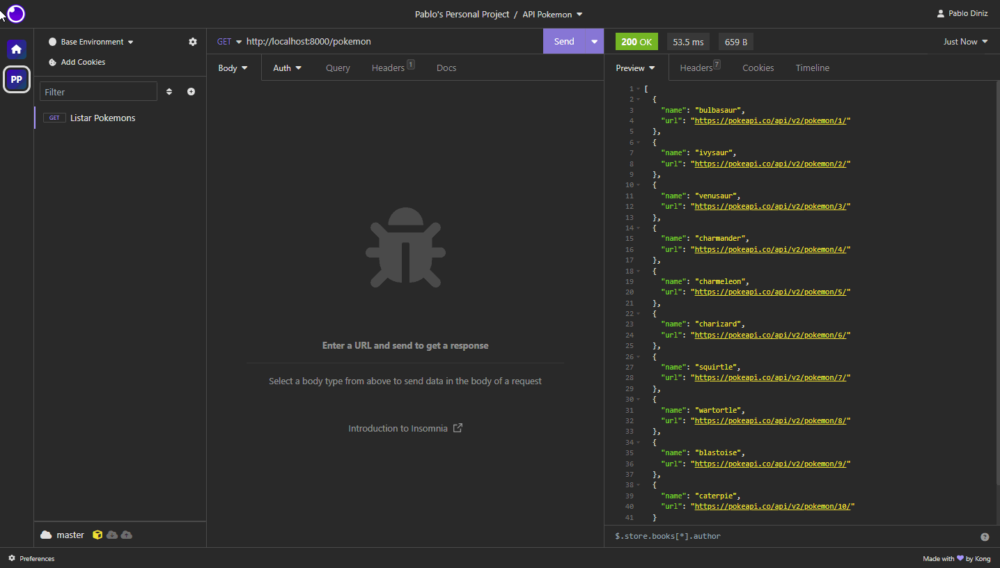
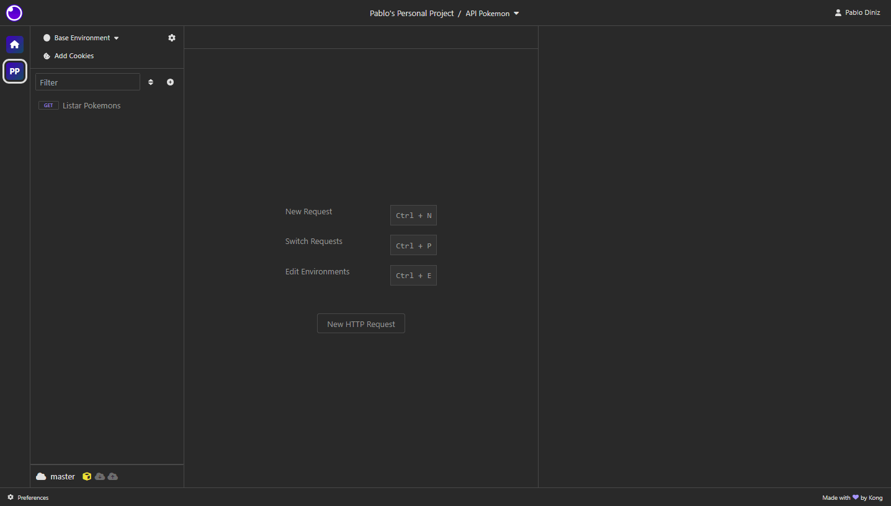

# API Pokémon

Projeto do curso Desenvolvimento de Software com foco em backend oferecido pela Cubos Academy.

Este projeto é uma API que mostra uma lista de pokémons e detalha informações sobre pokémons feito inteiramente em Javascript.

## Ferramentas

Para que este projeto possa ser executado é necessário instalar na sua máquina as seguintes ferramentas: 

- [Visual Studio Code](https://code.visualstudio.com/download)
- [NodeJS](https://nodejs.org/pt-br/download)
- [Git](https://git-scm.com/downloads)
- [Insomnia](https://insomnia.rest/download)

Aqui no Github faça um fork do projeto, abra o VS Code e no terminal digite o seguinte comando para clonar o projeto para sua máquina:

`git clone https://github.com/USERDOGITHUB/api-pokemon.git`

Após ter feito isso, no VS Code você deverá instalar algumas dependências para que o projeto funcione, sendo a primeira o framework Express para que possa criar um servidor local em sua máquina.

`npm install express`

A segunda dependência a ser instalada é a utils-playground que serve para listar e detalhar os pokémons.

`npm install utils-playground`

E por fim a última dependência que é o nodemon, serve para que sempre que houver alguma mudança no código ele reinicie o servidor automaticamente (essa dependência não é obrigatória para que o projeto funcione).

`npm install -D nodemon`

## Execução

Antes de iniciar o servidor vá no arquivo package.json e no objeto de script e digite o seguinte código:

`"dev": "nodemon ./src/index.js"`

Feito isso agora podemos iniciar o servidor com o comando:

`npm run dev`

No aplicativo Insomnia crie uma request collection como no gif abaixo:

Para acessar a rota de fazer a listagem de pokémons você deve criar uma HTTP Request e digitar na URL do Insomnia: 'http://localhost:8000/pokemon'

Com isso verá que o servidor já está funcionando e fez a listagem dos pokémons. 

Se quiser ver outra página de listagem de pokémons basta enviar uma requisição com um corpo (body) no formato JSON com o número da página. Caso você decida por não passar o número da página pelo body e só enviar a request o Insomnia mostrará a primeira página.

Para a segunda rota que é o detalhamento de um pokémon, basta seguir os mesmos passos da primeira rota só que modificando o nome da request, a URL e sem um corpo (body) no formato JSON na requisição.

Nessa rota é possível fazer o detalhamento do pokémon através do nome do pokémon ou por um numero ID que são passados pela URL.

---

Há uma segunda forma de acessar essa API através de um navegador, bastando ir na URL do navegador e digitar http://localhost:8000/pokemon para fazer a listagem de pokémon e http://localhost:8000/pokemon/NOMEPOKEMON para detalhar um pokémon.